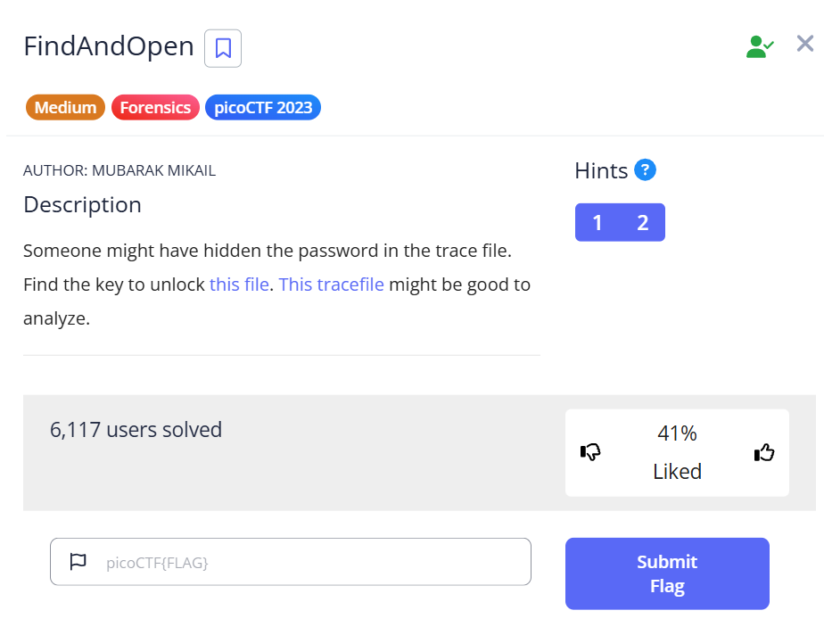
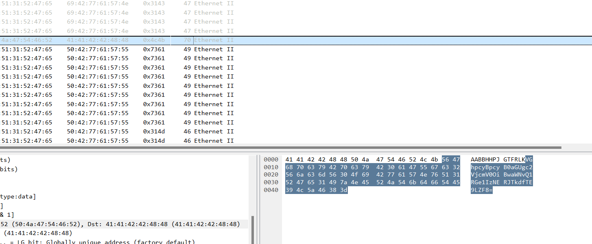

# FindAndOpen



Tải về được 2 file pcap và zip. Vì zip cần có key nên đi phân tích file pcap trược. Trong file pcap làm theo hướng dẫn được nữa flag đầu được base64.



điều cần làm là decode được ```This is the secret: picoCTF{R34DING_LOKd_``` . ko còn tìm thêm được đi nên dùng thử nửa đâu flag để giải file zip và được file flag. key ```picoCTF{R34DING_LOKd_``` .

```
╭─   nart   ~/daynow                                                              80 ✘  29s   11:17:59 PM  ─╮
╰─❯ unzip flag.zip                                                                                                   ─╯
Archive:  flag.zip
[flag.zip] flag password:
password incorrect--reenter:
 extracting: flag
╭─   nart   ~/daynow                                                                  ✔  7s   11:20:07 PM  ─╮
╰─❯ cat flag                                                                                                         ─╯
picoCTF{R34DING_LOKd_fil56_succ3ss_5ed3a878}
```

flag : ```picoCTF{R34DING_LOKd_fil56_succ3ss_5ed3a878}```
