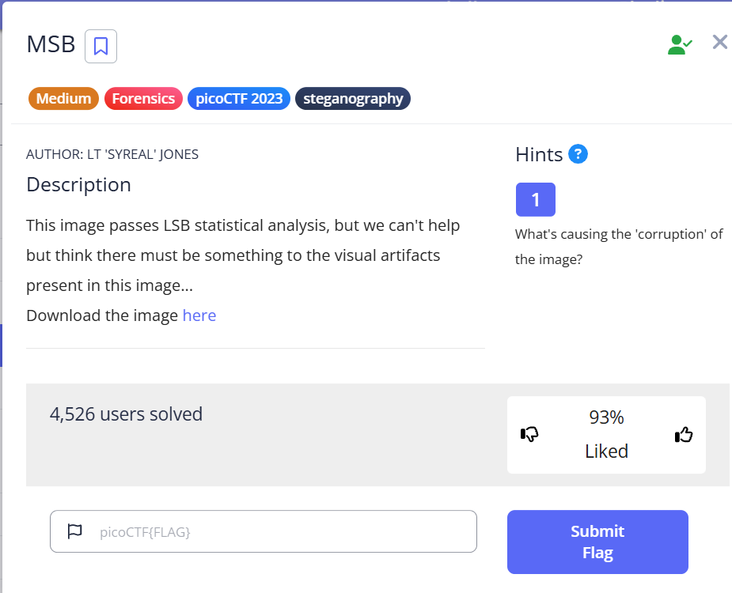
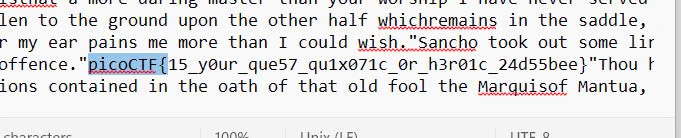

# MSB



Bài này được 1 file hình ảnh và theo gợi ý thì nó là dạng LSB nên sài tool sau ```wget https://raw.githubusercontent.com/Pulho/sigBits/master/sigBits.py```. Dùng câu lệnh ```python3 sigBits.py -t=msb Ninja-and-Prince-Genji-Ukiyoe-Utagawa-Kunisada.flag.png``` . xong sẽ được 1 file output mở là find theo ```pico``` được flag.



flag : ```picoCTF{15_y0ur_que57_qu1x071c_0r_h3r01c_24d55bee}```