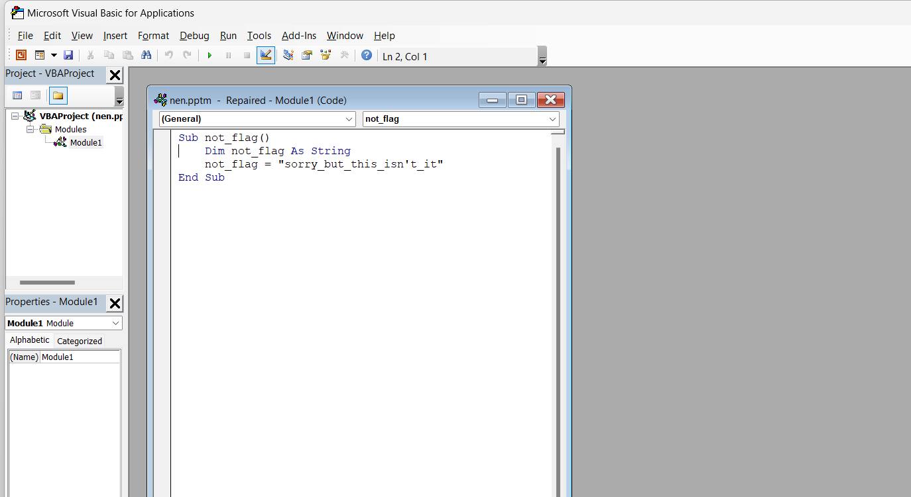
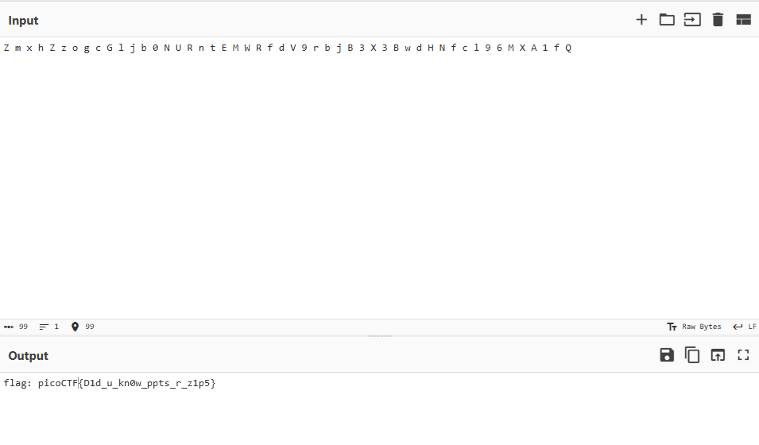

***MacroHard WeakEdge***


tài file về tui được file ```pptm```, do tìm kiếm trong file powerpoint này không được gì sẽ tiếp tục tìm kiếm bên ngoài nó.



Giờ sẽ giải nén đó tìm kiếm thông tin. May mắn là tôi vô tình lướt qua 1 file bị ẩn.

```python
╭─   nart   ~/test                                                                           ✔  10:40:00 PM  ─╮
╰─❯ ls                                                                                                               ─╯
'[Content_Types].xml'   _rels   docProps   nen.pptm   ppt
╭─   nart   ~/test                                                                           ✔  10:40:01 PM  ─╮
╰─❯ cd ppt                                                                                                           ─╯
╭─   nart   ~/test/ppt                                                                       ✔  10:40:17 PM  ─╮
╰─❯ ls -la                                                                                                           ─╯
total 56
drwxr-xr-x 7 nart nart 4096 Nov  7 17:50 .
drwxr-xr-x 5 nart nart 4096 Nov  7 18:00 ..
drwxr-xr-x 2 nart nart 4096 Nov  7 17:50 _rels
-rw-r--r-- 1 nart nart  818 Jan  1  1980 presProps.xml
-rw-r--r-- 1 nart nart 5197 Jan  1  1980 presentation.xml
drwxr-xr-x 3 nart nart 4096 Nov  7 17:50 slideLayouts
drwxr-xr-x 3 nart nart 4096 Nov  7 17:50 slideMasters
drwxr-xr-x 3 nart nart 4096 Nov  7 17:50 slides
-rw-r--r-- 1 nart nart  182 Jan  1  1980 tableStyles.xml
drwxr-xr-x 2 nart nart 4096 Nov  7 17:50 theme
-rw-r--r-- 1 nart nart 7168 Jan  1  1980 vbaProject.bin
-rw-r--r-- 1 nart nart  811 Jan  1  1980 viewProps.xml
╭─   nart   ~/test/ppt                                                                       ✔  10:40:19 PM  ─╮
╰─❯ cd slideMasters                                                                                                  ─╯
╭─   nart   ~/test/ppt/slideMasters                                                          ✔  10:40:30 PM  ─╮
╰─❯ ls -la                                                                                                           ─╯
total 32
drwxr-xr-x 3 nart nart  4096 Nov  7 17:50 .
drwxr-xr-x 7 nart nart  4096 Nov  7 17:50 ..
drwxr-xr-x 2 nart nart  4096 Nov  7 17:50 _rels
-rw-r--r-- 1 nart nart    99 Oct 23  2020 hidden
-rw-r--r-- 1 nart nart 13875 Jan  1  1980 slideMaster1.xml
╭─   nart   ~/test/ppt/slideMasters                                                          ✔  10:40:32 PM  ─╮
╰─❯ strings hidden                                                                                                   ─╯
Z m x h Z z o g c G l j b 0 N U R n t E M W R f d V 9 r b j B 3 X 3 B w d H N f c l 9 6 M X A 1 f Q
```

Trong file đó là đoạn mã nhìn có vẻ là base64 sau khi xử lý thì lấy được flag.



flag : ```picoCTF{D1d_u_kn0w_ppts_r_z1p5}```