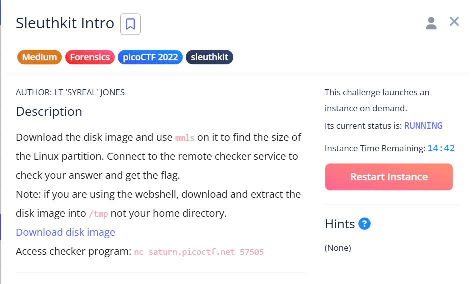

***Sleuthkit Intro***



Bài này yêu cầu tìm độ dài của linux trong ở đĩa và gửi lại chương trình. Đầu tiên là tìm độ dài.

```python
╭─   nart   ~/test                                                                           ✔  11:34:08 PM  ─╮
╰─❯ mmls disk.img                                                                                                    ─╯
DOS Partition Table
Offset Sector: 0
Units are in 512-byte sectors

      Slot      Start        End          Length       Description
000:  Meta      0000000000   0000000000   0000000001   Primary Table (#0)
001:  -------   0000000000   0000002047   0000002048   Unallocated
002:  000:000   0000002048   0000204799   0000202752   Linux (0x83)
```

Có thể thấy độ dài của linux là ```0000204799``` tức là ```204799``` giờ truy cập sever và gửi độ dài là xong yêu cầu.

```python
╭─   nart   ~/test                                                                           ✔  11:35:07 PM  ─╮
╰─❯  nc saturn.picoctf.net 57505                                                                                     ─╯
What is the size of the Linux partition in the given disk image?
Length in sectors: 202752
202752
Great work!
picoCTF{mm15_f7w!}
```

flag : ```picoCTF{mm15_f7w!}```

