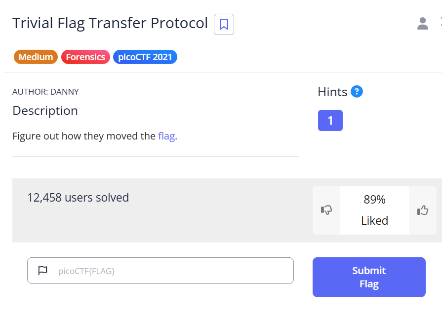
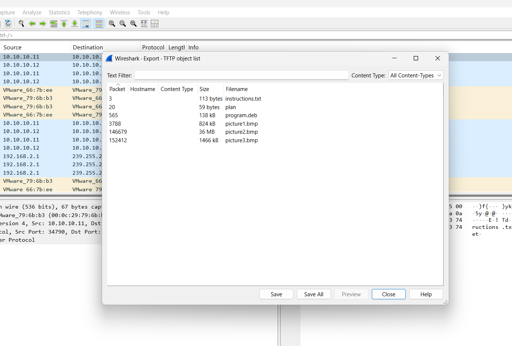

***Trivial Flag Transfer Protocol***



Tài file về được file pcap mở lên và check được những file như sau.



đọc thử file ```instuctions.txt```.

```python
╭─   nart   ~/test                                                                           ✔  01:46:00 PM  ─╮
╰─❯ strings instructions.txt                                                                                         ─╯
GSGCQBRFAGRAPELCGBHEGENSSVPFBJRZHFGQVFTHVFRBHESYNTGENAFSRE.SVTHERBHGNJNLGBUVQRGURSYNTNAQVJVYYPURPXONPXSBEGURCYNA
```

Base64 đoạn code sau không được gì, do đó đi ROT13 được nghĩa như sau:

```
TFTPDOESNTENCRYPTOURTRAFFICSOWEMUSTDISGUISEOURFLAGTRANSFER.FIGUREOUTAWAYTOHIDETHEFLAGANDIWILLCHECKBACKFORTHEPLAN
```
Viết lại là:

```
TFTP DOESNT ENCRYPT OUR TRAFFIC SOWE MUST DISGUI SEOUR FLAG TRANSFER.FIGURE OUT AWAY TO HIDE THE FLAG AND I WILL CHECK BACK FOR THE PLAN
```
Có vẻ như phải kiểm tra thứ gì mang tên PLAN. PLAN chứa nội dung như sau:

```
╭─   nart   ~/test                                                                           ✔  01:53:32 PM  ─╮
╰─❯ cat plan                                                                                                         ─╯
VHFRQGURCEBTENZNAQUVQVGJVGU-QHRQVYVTRAPR.PURPXBHGGURCUBGBF
```
decode ROT13 nó.

```
IUSEDTHEPROGRAMANDHIDITWITH-DUEDILIGENCE.CHECKOUTTHEPHOTOS
```

dịch ra

```
I USED THE PROGRAM AND HID IT WITH - DUEDILIGENCE.CHECK OUT THE PHOTOS
```
có vẻ đã dùng 1 chương trình để giấu key trong hình ảnh với từ khóa ```DUEDILIGENCE```. Sau 1 lúc mò thì ra được công cụ [sau](https://steghide.sourceforge.net/download.php). Cú pháp : 
```c++
steghide extract -sf <fiflename> -p <password>
```

Sài tool được 1 tệp flag:

```
╭─   nart   ~/test                                                                         1 ✘  02:02:03 PM  ─╮
╰─❯ steghide extract -sf picture3.bmp -p "DUEDILIGENCE"                                                              ─╯
wrote extracted data to "flag.txt".
```
flag đây rồi:

```
╭─   nart   ~/test                                                                           ✔  02:03:53 PM  ─╮
╰─❯ cat flag.txt                                                                                                     ─╯
picoCTF{h1dd3n_1n_pLa1n_51GHT_18375919}
```

flag : ```picoCTF{h1dd3n_1n_pLa1n_51GHT_18375919}```