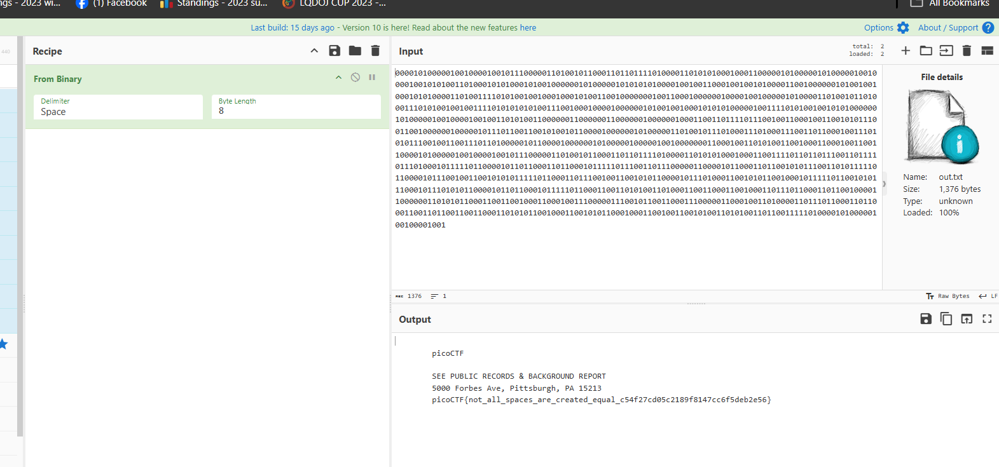

***WhitePages***


Khi tải về được 1 file trắng tinh.

```python
╭─   nart   ~/test                                                                           ✔  11:45:59 PM  ─╮
╰─❯ cat whitepages.txt                                                                                               ─╯
                                                                                                                                                                                                                                                                                                                                                                                                                                                                                                                                                                                                                                                                                                                                                                                                                                                                                                                                                                                                                                                                                                                                                                                                                                                                                                                                                                                                                                
```

Thử mở nó trên ứng dụng khác.


có vẻ nó có sự khác biệt giữa các con số, và nhìn đoán là mã nhị phân nên viết 1 chương trình ngôn ngữ python để tách nó.

```python
# Mở tệp input và đọc nội dung
with open('whitepages.txt', 'r') as infile:
    content = infile.read()

# Lấy ký tự đầu tiên
first_char = content[0]

# Chuỗi kết quả
result = ''

# So sánh các ký tự và tạo chuỗi kết quả
for char in content:
    if char == first_char:
        result += '0'
    else:
        result += '1'

# Ghi chuỗi kết quả vào tệp output
with open('out.txt', 'w') as outfile:
    outfile.write(result)
}
```

Tách đương 1 file nhị phân như sau.

```c++
╭╭─   nart   ~/test                                                                                                                 ✔  12:09:17 AM  ─╮
╰─❯ python3 decode.py whitepages.txt                                                                                                                       ─╯
╭─   nart   ~/test                                                                                                                 ✔  12:10:05 AM  ─╮
╰─❯ ls                                                                                                                                                     ─╯
decode.py  out.txt  whitepages.txt
╭─   nart   ~/test                                                                                                                 ✔  12:10:08 AM  ─╮
╰─❯ cat out.txt                                                                                                                                            ─╯
00001010000010010000100101110000011010010110001101101111010000110101010001000110000010100000101000001001000010010101001101000101010001010010000001010000010101010100001001001100010010010100001100100000010100100100010101000011010011110101001001000100010100110010000000100110001000000100001001000001010000110100101101000111010100100100111101010101010011100100010000100000010100100100010101010000010011110101001001010100000010100000100100001001001101010011000000110000001100000010000001000110011011110111001001100010011001010111001100100000010000010111011001100101001011000010000001010000011010010111010001110100011100110110001001110101011100100110011101101000001011000010000001010000010000010010000000110001001101010011001000110001001100110000101000001001000010010111000001101001011000110110111101000011010101000100011001111011011011100110111101110100010111110110000101101100011011000101111101110011011100000110000101100011011001010111001101011111011000010111001001100101010111110110001101110010011001010110000101110100011001010110010001011111011001010111000101110101011000010110110001011111011000110011010100110100011001100011001000110111011000110110010000110000001101010110001100110010001100010011100000111001011001100011100000110001001101000011011101100011011000110011011001100110001101010110010001100101011000100011001001100101001101010011011001111101000010100000100100001001
```

chuyển đổi sang hệ đọc được.



flag : 
```c++
picoCTF{not_all_spaces_are_created_equal_c54f27cd05c2189f8147cc6f5deb2e56}
```