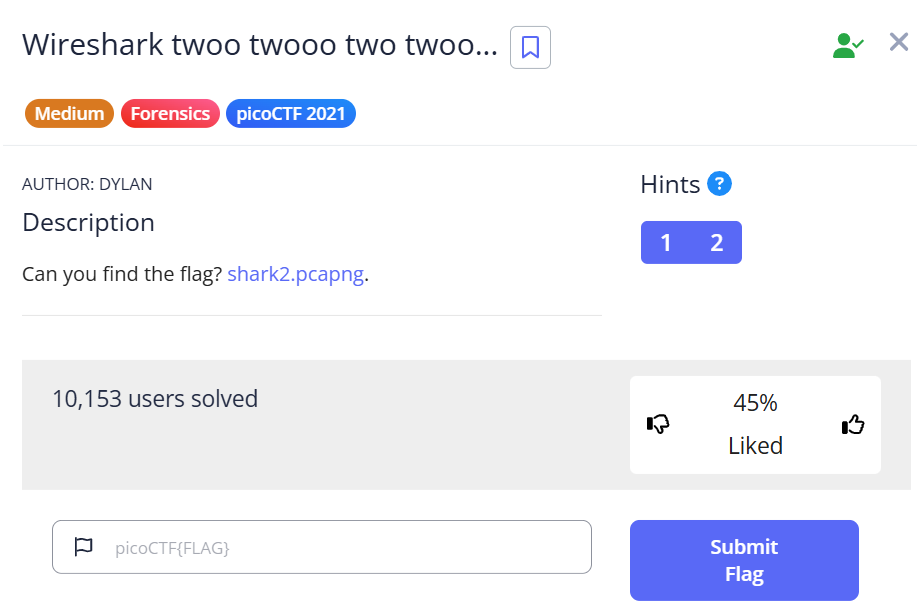
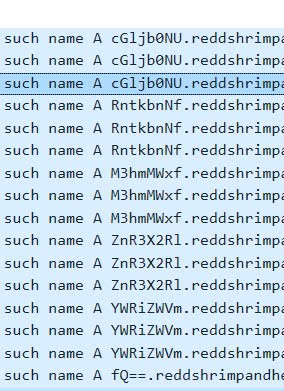
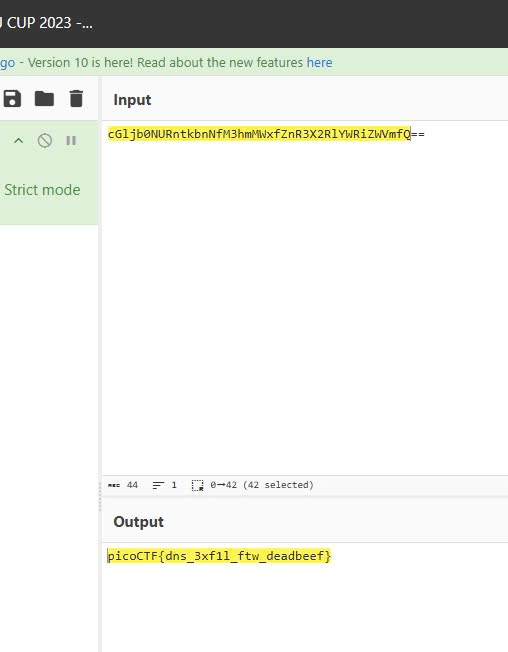

# Wireshark twoo twooo two twoo



Bài chúng ta được 1 file pcap. <br> Kiểm tra dns kéo tới dòng cuối thấy được dấu ```==``` biểu hiện của base64 nên ta sẽ kiểm tra thử.<br> Sau khi lại theo name dns được 1 chuỗi như sau.



```cGljb0NURntkbnNfM3hmMWxfZnR3X2RlYWRiZWVmfQ==```

decode base64 nó và có được flag.



flag : ```picoCTF{dns_3xf1l_ftw_deadbeef}```