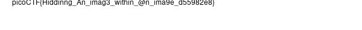

# hideme


Tải về được 1 file png sau 1 hồi xử lý như sau thì được flag.

```python
╭─   nart   ~/daynow                                                                         ✔  10:12:47 PM  ─╮
╰─❯ binwalk -e flag.png                                                                                              ─╯

DECIMAL       HEXADECIMAL     DESCRIPTION
--------------------------------------------------------------------------------
0             0x0             PNG image, 512 x 504, 8-bit/color RGBA, non-interlaced
41            0x29            Zlib compressed data, compressed
39739         0x9B3B          Zip archive data, at least v1.0 to extract, name: secret/
39804         0x9B7C          Zip archive data, at least v2.0 to extract, compressed size: 2876, uncompressed size: 3029, name: secret/flag.png
42915         0xA7A3          End of Zip archive, footer length: 22

╭─   nart   ~/daynow                                                                         ✔  10:13:06 PM  ─╮
╰─❯ ls                                                                                                               ─╯
_flag.png.extracted  flag.png
╭─   nart   ~/daynow                                                                         ✔  10:13:08 PM  ─╮
╰─❯ cd _flag.png.extracted                                                                                           ─╯
╭─   nart   ~/daynow/_flag.png.extracted                                                     ✔  10:13:10 PM  ─╮
╰─❯ ls                                                                                                               ─╯
29  29.zlib  9B3B.zip  secret
╭─   nart   ~/daynow/_flag.png.extracted                                                     ✔  10:13:11 PM  ─╮
╰─❯ file secret                                                                                                      ─╯
secret: directory
╭─   nart   ~/daynow/_flag.png.extracted                                                     ✔  10:13:20 PM  ─╮
╰─❯ cd secret                                                                                                        ─╯
╭─   nart   ~/daynow/_flag.png.extracted/secret                                              ✔  10:13:22 PM  ─╮
╰─❯ ls                                                                                                               ─╯
flag.png
╭─   nart   ~/daynow/_flag.png.extracted/secret                                              ✔  10:13:23 PM  ─╮
╰─❯ file flag.png                                                                                                    ─╯
flag.png: PNG image data, 600 x 50, 16-bit grayscale, non-interlaced
```



flag : ```picoCTF{Hiddinng_An_imag3_within_@n_ima9e_d55982e8}```