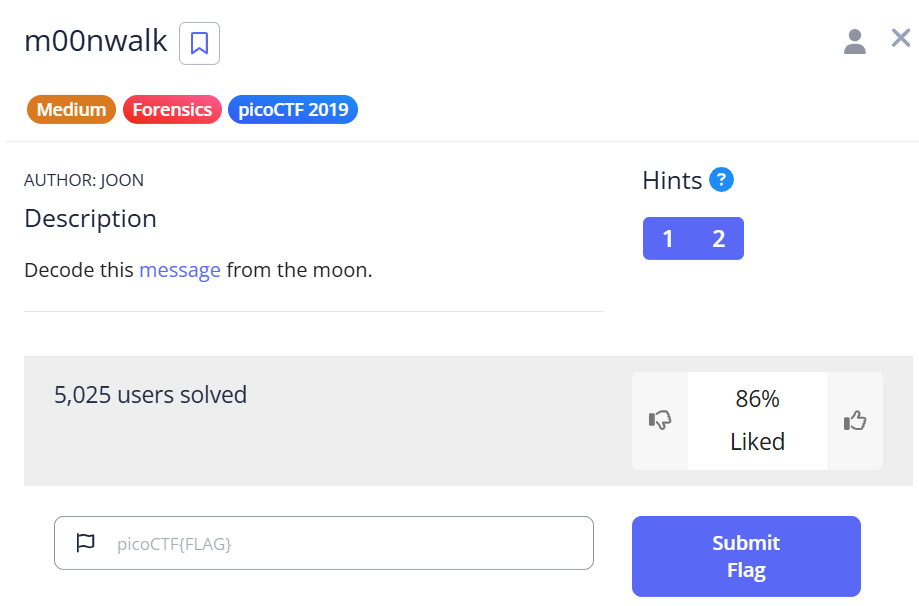
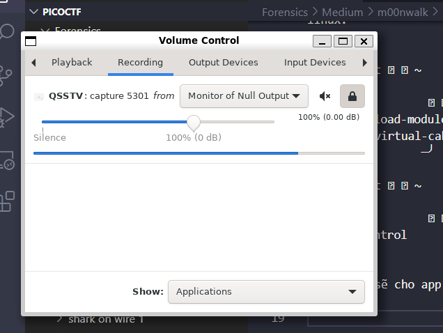
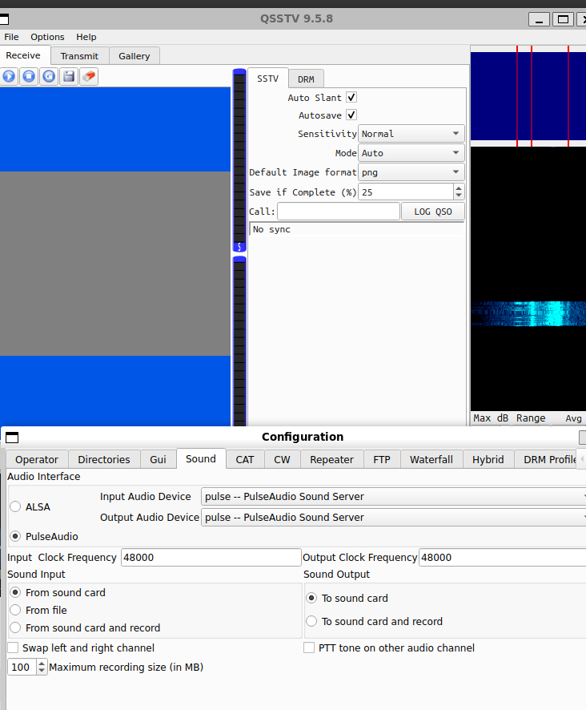
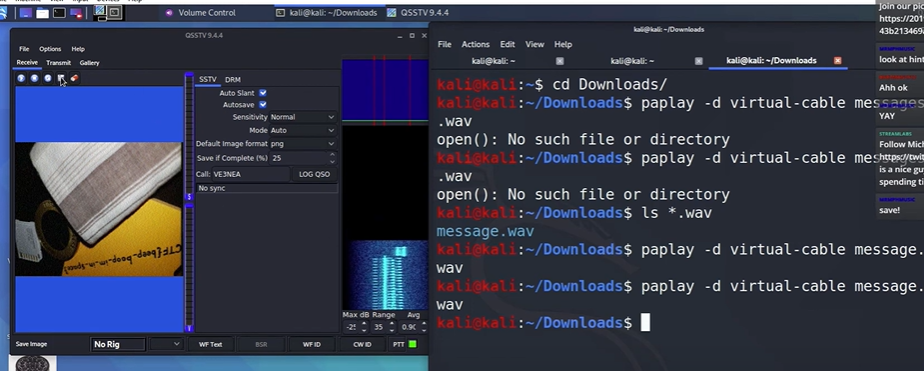

***m00nwalk***



Này là 1 bài về [SST](https://en.wikipedia.org/wiki/Slow-scan_television) chúng ta có thể giải khi dùng phương pháp [này](https://ourcodeworld.com/articles/read/956/how-to-convert-decode-a-slow-scan-television-transmissions-sstv-audio-file-to-images-using-qsstv-in-ubuntu-18-04).
<br>
Đầu tiên sẽ mở ```pacucontrol``` lên, mở riêng 1 cửa sổ linux.

```pyton
╭─   nart   ~                                                                                ✔  02:50:47 PM  ─╮
╰─❯ pactl load-module module-null-sink sink_name=virtual-cable                                                       ─╯
23
╭─   nart   ~                                                                                ✔  02:50:54 PM  ─╮
╰─❯ pavucontrol     
```

chạy xong sẽ cho app chúng ta chỉnh như sau.



Sau đó đến qsstv

```
╰─❯ ls                                                                                                               ─╯
message.wav
╭─   nart   ~/test                                                                           ✔  02:47:48 PM  ─╮
╰─❯ qsstv    
```

Chúng ta được của sổ vào setting chỉnh như sau.



Sau đỏ mở 1 cửa số linux khác và chạy lệnh sau tận hưởng thành quả.

```
╭─   nart   ~/test                                                                ✔  3m 14s   02:58:33 PM  ─╮
╰─❯ paplay -d virtual-cable message.wav  
```

do 1 vài vấn đề nên tôi không thấy được flag. nên là...



flag : ```picoCTF{beep_boop_im_in_space}```

