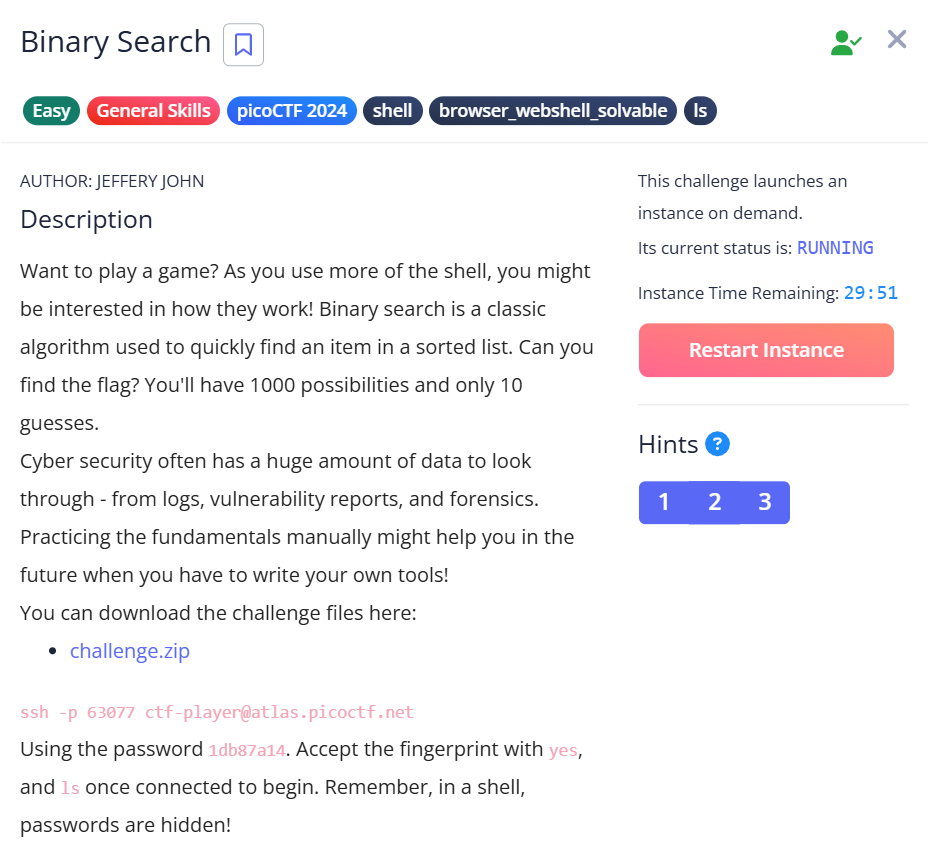

***Binary Search***



Bài này yêu cầu đoán số 1 - 1000 chỉ với 10 lược đoán, thì cách hay nhất mà tác giả có thể nghĩ ra là chặt nhị phân.
Sau đây là quá trình đoán số của tác giá.

```python
╭─   nart   ~/picoCTF    main !2                                                         ✔  11:53:25 PM  ─╮
╰─❯ ssh -p 63077 ctf-player@atlas.picoctf.net                                                                       ─╯
The authenticity of host '[atlas.picoctf.net]:63077 ([18.217.83.136]:63077)' can't be established.
ED25519 key fingerprint is SHA256:M8hXanE8l/Yzfs8iuxNsuFL4vCzCKEIlM/3hpO13tfQ.
This key is not known by any other names.
Are you sure you want to continue connecting (yes/no/[fingerprint])? ýe
Please type 'yes', 'no' or the fingerprint: yes
Please type 'yes', 'no' or the fingerprint: yes
Warning: Permanently added '[atlas.picoctf.net]:63077' (ED25519) to the list of known hosts.
ctf-player@atlas.picoctf.net's password:
Welcome to the Binary Search Game!
I'm thinking of a number between 1 and 1000.
Enter your guess: 500
Lower! Try again.
Enter your guess: 250
Higher! Try again.
Enter your guess: 375
Lower! Try again.
Enter your guess: 312
Higher! Try again.
Enter your guess: 343
Higher! Try again.
Enter your guess: 359
Lower! Try again.
Enter your guess: 351
Lower! Try again.
Enter your guess: 347
Congratulations! You guessed the correct number: 347
Here's your flag: picoCTF{g00d_gu355_1597707f}
Connection to atlas.picoctf.net closed.
```

Flag : ```picoCTF{g00d_gu355_1597707f}```