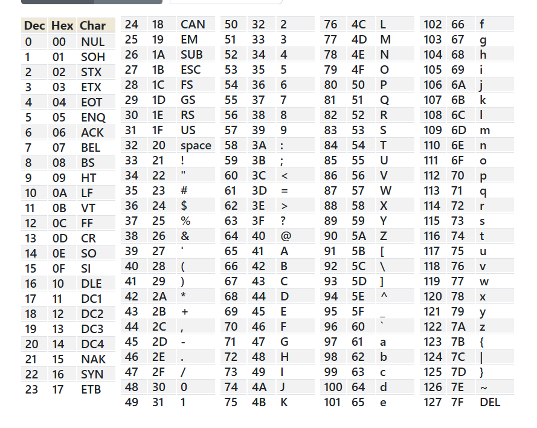

***endianness***


Bài này khi truy cập vào sever bằng cú pháp ```nc titan.picoctf.net 61397``` ta thấy được như sau: 

```python
╭─   nart   ~                                                                                ✔  11:05:06 PM  ─╮
╰─❯ nc titan.picoctf.net 61397                                                                                       ─╯
Welcome to the Endian CTF!
You need to find both the little endian and big endian representations of a word.
If you get both correct, you will receive the flag.
Word: xlxya
Enter the Little Endian representation:
```

Chương trình yêu cầu nhập đoạn mã sau khi chuyển đổi ký tự thành [little endian](https://viblo.asia/p/little-endian-vs-big-endian-E375z0pWZGW). Cách chuyển đổi như sau đầu tiên đổi ký tự sang dạng hex.



test đề cho ``xlxya`` thì chuyển sang hex được ``` 78 6C 78 79 61```.
<br>
chuyển sang little endian thì ghi từ phải sang trái không cách ```6179786C78```.
chuyển sang big edian thì ghi từ trái sang phải không cách ```786C787961```

sau khi nhập xong chúng ta được flag:

```python
╭─   nart   ~                                                                                ✔  11:05:06 PM  ─╮
╰─❯ nc titan.picoctf.net 61397                                                                                       ─╯
Welcome to the Endian CTF!
You need to find both the little endian and big endian representations of a word.
If you get both correct, you will receive the flag.
Word: xlxya
Enter the Little Endian representation: 6179786C78
Correct Little Endian representation!
Enter the Big Endian representation: 786C787961
Correct Big Endian representation!
Congratulations! You found both endian representations correctly!
Your Flag is: picoCTF{3ndi4n_sw4p_su33ess_28329f0a}
```

flag : ```picoCTF{3ndi4n_sw4p_su33ess_28329f0a}```

